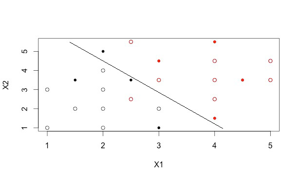

```{r}
library(pracma)
library(MASS)
library(class)
library(lattice)
library(ggplot2)
rm(list=ls())
```

Welcome to the third PAMI demo/homework (year 2016): classification

In this demo we will learn to do classification (\"manually\" and using ready-made
R functions) on a very simple dataset. The purpose of the demo is both to show
you how to solve classification problems in R and to allow you to assess your
knowledge about this topic, using some questions which are similar to the ones
which are usually asked during the written exam. For this reason, the size of
the problem is very small, so you should be able to perform all your calculations 
on paper and then use the results you get in R to verify you did everything right.

Let us first generate the dataset.

```{r}
# prepare data
X1 = c(1,1,1.5,2,2,2,2,3,2.5,2.5,3,4,4,4,5,5)
X2 = c(1,3,2,1,2,3,4,2,2.5,5.5,3.5,2.5,3.5,4.5,3.5,4.5)
Y = c(1,1,1,1,1,1,1,1,2,2,2,2,2,2,2,2)
m = data.frame(cbind(X1,X2,Y))

plot(m[,1:2])
points(m[Y==2,1:2], col='red')
```

The total number of observations is 16, evenly divided in two classes (1=black and 2=red).
Observations are 2-dimensional, but to explain calculations step-by-step we will start taking
into account just the first dimension. Below here you can see the values of the variable X1
and the labels that have been assigned to the observations:

```{r}
print(rbind(X1,Y))
```

```{r}
# split data to easiy access the different classes
# m1 are all the 2D points in class 1, m2 are the 2D points in class 2
m1 = m[m$Y==1,1:2]
m2 = m[m$Y==2,1:2]
n = dim(m)[1]
n1 = dim(m1)[1]
n2 = dim(m2)[1]

# p values are the priors (the probability that one element belongs to a given class k)
p = as.matrix(c(n1/n, n2/n))

# m1_ and m2_ represent our observations in 1D (using only the X1 values)
m1_ = m1[,1]
m2_ = m2[,1]
```

Let us now perform LDA on this 1-dimensional dataset. If you check out the lab material
on LDA (http://davide.eynard.it/teaching/2016_PAMI/Lab10.pdf) you will see that an 
observation x is classified with the class k that returns the highest *discriminant 
function* 

  delta_k(x) = x * mu_k/sigma^2 - mu_k^2/(2*sigma^2) + log(pi_k)

where:

  mu_k are the estimated means of the observations for each class k
  sigma^2 is the estimated variance of the class distributions (note that we assume
          the variance is the same for all classes - we can approximate a common
          variance from the data using pooled variance: see Lab10 notes)
  pi_k are the priors for each class k (n_k/n)

**Q1) Calculate all the parameters you need for LDA classification (mu_k, sigmasq, and pi_k). Try to do that manually first, then write the R code to do that below here and verify that your results are consistent.**
    
```{r}
# calculate means for m1_ and m2_
mu1 = mean(m1_)
mu2 = mean(m2_)

# calculate pooled variance
s1 = sum((m1_-mu1)^2)/(n1-1)
s2 = sum((m2_-mu2)^2)/(n2-1)
sigmasq = ((n1-1)*s1 + (n2-1)*s2)/(n-2)

# pi_k values have already been calculated as p[k] before
cat("mu_1 =",mu1,",mu_2 =",mu2,",sigmasq =",sigmasq,",p_1 = p_2 = 0.5")
```

---

The previous formula for the discriminant function is linear in x (i.e. a_k * x + b_k).

**Q2) Calculate now the a_k, b_k parameters that you will use within the discriminant functions later.**
    
```{r}
a1 = mu1/sigmasq
a2 = mu2/sigmasq
b1 = log(p[1]) - mu1^2/(2*sigmasq)
b2 = log(p[2]) - mu2^2/(2*sigmasq)

cat("delta_1(x) =",a1,"x +(",b1,")
delta_2(x) =",a2,"x +(",b2,")")
# the label k assigned to an observation x is the one that corresponds to the biggest delta_k(x) 
```

---

Classification according to your LDA implementation returns the following labels:

```{r}
lbls = max.col(cbind(a1 * m[,1] + b1, a2 * m[,1] + b2))
print(lbls)
```

... and here are both the table comparing labels and ground-truth and the classification accuracy:

```{r}
print(table(lbls,Y))
print(mean(lbls == Y))
```

**Q3) What is the result of your classification? Are there any wrong labels (and in this case could you explain why)? How much is the accuracy?**

We classificated all our samples with accuracy=13/16=0.8125. 
Assume Y=1 - negative and Y=2 - positive we can say that false negative rate=1/8=0.125 and false positive rate=2/8=0.25.

These wrong labels occured because of our discriminant functions and their decision boundary. If take a look at density plot, we can notice that m1_ and m2_ crossing each other and that occurs our wrong labels.
```{r}
densityplot(~m1_+m2_, scales=list(relation="free"))
```

---

**Q4) What is the value of the boundary between class 1 and 2? How do you calculate it?**

Since K=2 (2 classes) and p_1=p_2=0.5, we can say that *decision boudary* is at x=(mu1 + mu2)/2 (it's also a solution of delta_1(x)=delta_2(x)), so
```{r}
db = (mu1 + mu2)/2
print(db)
```
---

Let us now perform LDA on the full 2D dataset. As some calculations (e.g. matrix
inversion) are not trivial to do manually, feel free to use the help of R ;-)

```{r}
# 2D case: get means
mu1 = as.matrix(colMeans(m1))
mu2 = as.matrix(colMeans(m2))

# get covariances
s1 = cov(m1)
s2 = cov(m2)

# calculate pooled covariance and its inverse
S = ((n1-1)*s1+(n2-1)*s2)/(n-2)
Si = inv(S)

# calculate deltas
deltas = cbind(as.matrix(m[,1:2]) %*% Si %*% mu1 - as.double(1/2 * t(mu1) %*% Si %*% mu1 + log(p[1])),
               as.matrix(m[,1:2]) %*% Si %*% mu2 - as.double(1/2 * t(mu2) %*% Si %*% mu2 + log(p[2])))
```

Classification according to your LDA implementation returns the following labels:

```{r}
lbls = max.col(deltas)
print(lbls)
```

... and here are both the table comparing labels and ground-truth and the classification accuracy:

```{r}
print(table(lbls,Y))
print(mean(lbls == Y))
```

Now complete the source code of this script to run LDA using the builtin function 
provided in R and show your results are consistent with it.

**Q5) What is the result of your classification? Are there any wrong labels (and in this case could you explain why)? How much is the accuracy?**
    
```{r}
lda.fit = lda(Y ~ X1 + X2, data=m)
lda.pred = predict(lda.fit, newdata = m[,1:2])
lda.class = lda.pred$class
print(table(lda.class,Y))
print(mean(lda.class == Y))
```

We classificated all our samples with accuracy=15/16=0.9375. 
Assume Y=1 - negative and Y=2 - positive we can say that false negative rate=0 and false positive rate=1/8=0.125.

We also shown that manually calculated discriminant function is correct (no difference with builtin function).

Mislabels occuring because LDA split our 2D space into 2 parts with a line (decision boundary), where each part means specific class, and some samples with class A are in the part of B class, so they are classifated with label B.

---

Until now, we have just tried to understand how well our model fits the original data
(i.e. the training data). However, we did not conclude anything about how well it will
describe *new* data! Here are some new observations (shown as dots in the plot).

```{r}
X1 = c(1.5,2,2.5,3,3,4,4,4.5)
X2 = c(3.5,5,3.5,1,4.5,1.5,5.5,3.5)
Y = c(1,1,1,1,2,2,2,2)
m.test = data.frame(cbind(X1,X2,Y))

plot(m[,1:2])
points(m[m[,3]==2,1:2], col='red')
points(m.test[,1:2],pch=20)
points(m.test[m.test[,3]==2,1:2], pch=20, col='red')
```

**Q6) Run the lda predictor you trained using the previous observations to classify the new set of observations and comment the result. Is it expected? Are there any misclassifications and if so which ones and for what reason? Can you draw a (rough) classification boundary from the results you got? Can you actually calculate it, similarly to what you did in the 1D case?**

NOTE: to classify the new test set, you can use the lda.fit variable you obtained during training
          
```{r}
lda.pred = predict(lda.fit, newdata = m.test[,1:2])
lda.class = lda.pred$class
print(table(lda.class, m.test[,3]))
print(mean(lda.class == m.test[,3]))
```

We classificated our testing data set with model trained on training dataset. Accuracy decreased, but it was expected since we didn't know characteristics of the new data. To increase accuracy we can combine our 2 dataset and perform some resamplind methods (such as cross-validation).

Mislabels occuring because LDA split our 2D space into 2 parts with a line (decision boundary), where each part means specific class, and some samples with class A are in the part of B class, so they were classifated with label B.

Decision boundary can be calculated as solution to delta_1(x1,x2)=delta_2(x1,x2) (same idea as 1D LDA) and should look like this:


